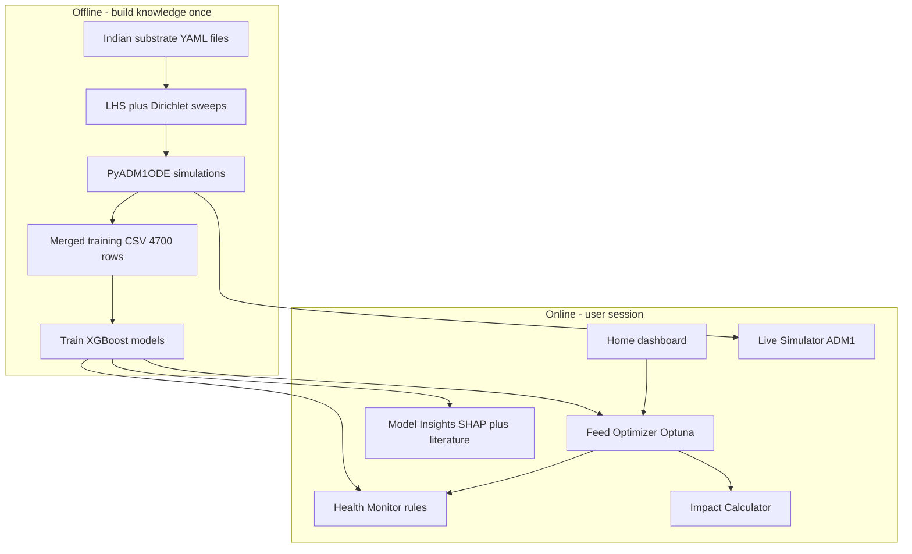

# BioOptima — Project Guide

*Reference document for project demonstration, viva, and report writing.*

This guide explains **what BioOptima is**, **why we built it this way**, and **how to present it**, assuming no prior background in biogas engineering, computer science, or machine learning. Technical depth for developers remains in `PROJECT_DOCUMENTATION.md`; setup commands are in `README.md`.

---

## Table of contents

1. [One-page summary](#1-one-page-summary)
2. [Glossary](#2-glossary)
3. [Ten-minute live demo script](#3-ten-minute-live-demo-script)
4. [Background: biogas and the real problem](#4-background-biogas-and-the-real-problem)
5. [Why a digital twin (physics + machine learning + web app)](#5-why-a-digital-twin-physics--machine-learning--web-app)
6. [Architecture and design choices](#6-architecture-and-design-choices)
7. [What we built: step-by-step pipeline](#7-what-we-built-step-by-step-pipeline)
8. [Web application: page-by-page](#8-web-application-page-by-page)
9. [Results to quote](#9-results-to-quote)
10. [Limitations (be honest)](#10-limitations-be-honest)
11. [Fifteen-minute viva talk outline](#11-fifteen-minute-viva-talk-outline)
12. [Likely questions and answers](#12-likely-questions-and-answers)
13. [Appendix](#13-appendix)

---

## 1. One-page summary

### The problem

Many small and farm-scale **anaerobic digestion (AD)** plants in India run on **mixed waste**: cow dung, crop straw, occasional food waste, press mud from sugar mills, or poultry litter. Operators often lack:

- A quick way to ask: *“Given what I have today, what mix and loading give more methane without killing the digester?”*
- Simple health guidance when lab tests (pH, volatile fatty acids) are rare.
- A tool that connects **technical choices** to **money saved** and **environmental benefit**.

Running a full **physics model (ADM1)** for every button click is too slow (tens of seconds per case). Using only hand formulas is too rough for mixed Indian feeds.

### Our solution: BioOptima

**BioOptima** is a **biogas digital twin** with three layers:

| Layer | Role | Technology |
|-------|------|------------|
| **Physics (offline + on demand)** | Realistic process behaviour, training labels, deep time-series | **PyADM1ODE** (ADM1 — Anaerobic Digestion Model No. 1) |
| **Surrogate (instant)** | Fast methane and stability predictions in the UI | **XGBoost** models trained on thousands of ADM1 runs |
| **Interaction** | Farmer- and student-friendly tools | **Streamlit** web app (Python) |

### What the web app does today (six tools)

| Page | What it does in one sentence |
|------|------------------------------|
| **Home** | Shows whether models are loaded, last optimization snapshot, and a guided workflow. |
| **Feed Optimizer** | Enter daily waste (kg/day), temperature, HRT, OLR → get **recommended co-digestion mix** and predicted CH₄. |
| **Health Monitor** | Enter lab readings or simple symptoms → **stable / warning / critical** guidance and early warnings. |
| **Impact Calculator** | From predicted CH₄ → **rupee savings**, payback-style cash flow, CO₂ avoided, SDG messaging. |
| **Live Simulator** | Run **full ADM1** for ~30 days → pH, VFA, CH₄, ammonia curves (slow, physics-faithful). |
| **Model Insights** | **SHAP** feature importance for yield, literature validation scatter plot. |
| **About** | Short science background and how the pipeline fits together. |

### Headline numbers (current trained models)

| Metric | Value | Source |
|--------|-------|--------|
| Training rows | 4,700 | `models/eval_metrics.json` |
| Yield model (5-fold CV R²) | **0.998** | XGBoost regressor |
| Health classifier (5-fold CV F1 macro) | **0.832** | XGBoost (+ SMOTE pipeline in training) |
| Literature points validated | **21** total, **19** in training range | `models/literature_validation.json` |
| Literature MAPE (in-range, before correction) | **10.7%** | |
| Literature MAPE (after bias correction) | **8.5%** | Applied live in the app |

---

## 2. Glossary

Read this once; refer back during the viva.

| Term | Plain meaning | Analogy |
|------|---------------|---------|
| **Anaerobic digestion (AD)** | Bacteria break down organic waste **without oxygen** and produce **biogas** (rich in methane). | A sealed stomach-tank for waste. |
| **Biogas / CH₄** | Gas produced; **methane (CH₄)** is the useful fuel. | Like LPG, but from waste. |
| **Digester** | Tank where AD happens (liquid + gas headspace). | The “reactor” you operate. |
| **Feedstock** | What you put in (dung, straw, food waste, etc.). | Ingredients in a recipe. |
| **Co-digestion** | Mixing more than one feedstock. | Blending ingredients for better gas and stability. |
| **TS (total solids)** | Dry matter fraction in fresh waste. | How “solid” the feed feels. |
| **VS (volatile solids)** | Organic part of TS that can be converted to gas. | The part that actually “feeds” bacteria. |
| **OLR (organic loading rate)** | How much VS you load per m³ of reactor per day (kg VS/m³/d). | How hard you push the engine. |
| **HRT (hydraulic retention time)** | Average time liquid stays in the digester (days). | How long waste “cooks” before leaving. |
| **BMP** | Biochemical methane potential — literature methane per tonne of VS. | Theoretical fuel value of a feed. |
| **C/N ratio** | Carbon-to-nitrogen ratio of the mix. | Balance between “energy” and “protein”; affects stability. |
| **VFA (volatile fatty acids)** | Acidic intermediates; **high VFA** often means stress. | Sourness building up inside. |
| **pH** | Acidity; digesters usually need ~6.8–7.8. | Too low → sour, methanogens suffer. |
| **ADM1** | Standard **dynamic model** of AD (many species, pH, gas, kinetics). | Detailed flight simulator for a digester. |
| **Surrogate model** | Fast ML model that **approximates** ADM1 outputs. | A lightweight autopilot trained from flight data. |
| **Digital twin** | Computer copy of a real system used to test decisions. | Test plant on screen before changing the real plant. |
| **SHAP** | Method to explain **which inputs** pushed a prediction up or down. | “Which ingredient mattered most for this answer?” |
| **Bias correction** | Simple fix when predictions are systematically low vs published data. | Calibrating a scale that reads slightly light. |

---

## 3. Ten-minute live demo script

Use this order when presenting the running app (`streamlit run app.py`).

**Before you start:** Confirm models exist under `models/` (`yield_predictor.pkl`, `health_classifier.pkl`). Use the project virtual environment (see Appendix).

### Step 1 — Home (1 minute)

- Point out **Status: ready** and model accuracy bars (yield R², health F1).
- Explain the **workflow**: Optimize → Health → Simulate → Impact.
- Say: *“We focused the app on four core decisions a plant operator cares about, not fifteen scattered pages.”*

### Step 2 — Feed Optimizer (3 minutes)

- Enter a **realistic farm example**, e.g. 200 kg/day cow dung, 50 kg food waste, 0 straw, 35 °C, HRT 25 d, OLR 2.5.
- Click **Find best mix**.
- Show:
  - **Predicted CH₄** and **% improvement vs availability mix** (if you only fed waste in the proportions you *have*, vs optimized blend).
  - **Availability vs recommended** table (gray = what you have by weight; green = what the optimizer suggests).
  - **Donut chart** of recommended shares.
- One line to say: *“Availability is what arrives on the farm; recommended is what the model says to blend for more gas at the same operating point.”*

### Step 3 — Health Monitor (2 minutes)

- Use **Quick symptoms** OR lab sliders (pH 7.0, low VFA).
- Show **digester schematic** colour and **reading vs safe bands** chart.
- Say: *“In the live app we use **transparent rules** on pH and VFA; the ML classifier is trained but rules are easier to explain to an operator.”*

### Step 4 — Live Simulator (2 minutes, optional if time)

- Keep default feeds or match the farm case.
- Click **Run simulation** (warn: 15–60 seconds).
- Show **pH / VFA / CH₄** over time and mention **startup vs stress** shading if visible.
- Say: *“This is the real ADM1 physics — slow but credible for a thesis ‘physics layer’.”*

### Step 5 — Impact Calculator (1 minute)

- CH₄ should auto-fill from the optimizer session.
- Open **Financial** and **Environmental** tabs — LPG cylinders, rupees, CO₂, trees equivalent.
- Say: *“Illustrative economics for storytelling, not a bank loan model.”*

### Step 6 — Model Insights (1 minute)

- **Literature validation** tab: points near the diagonal = agreement with published Indian/co-digestion studies.
- **Yield SHAP** tab (may take ~20 s first load): which features move methane most.
- Mention **bias correction** improved MAPE from ~11% to ~8.5% on in-range papers.

---

## 4. Background: biogas and the real problem

### What is biogas?

Organic waste contains energy in carbon compounds. In a **closed, oxygen-free tank**, communities of bacteria:

1. **Break down** complex matter (hydrolysis).
2. **Ferment** to acids (acidogenesis).
3. **Convert** to acetate and similar (acetogenesis).
4. **Produce methane** (methanogenesis).

The gas is called **biogas**; after cleaning, **methane** can replace **LPG**, firewood, or grid electricity in rural settings.

### Why this matters in India

- **Cow dung** and **crop residues** (rice/wheat straw) are widely available.
- **Food waste** and **press mud** appear in clusters (markets, sugar industry).
- **Poultry litter** is high in nitrogen — powerful but risky if overdosed.
- Plants are often **small**, **under-instrumented**, and run by operators who cannot run a lab every day.

### What goes wrong (without needing equations)

| Symptom | What it means |
|---------|----------------|
| **Gas production drops** | Methanogens are struggling; often overload or imbalance. |
| **Sour smell** | Too much acid (VFA), pH falling. |
| **“Sour digester”** | Classic instability: acids faster than methane conversion. |
| **Foam / thick slurry** | Hydraulic or mixing issues; sometimes linked to protein-rich feeds. |

**Mix matters:** Too much straw without nitrogen-rich dung → slow, weak process. Too much food waste too fast → acid spike. BioOptima is built to make those trade-offs visible **before** the real tank fails.

---

## 5. Why a digital twin (physics + machine learning + web app)

### Option A — Only hand formulas

Simple formulas (BMP × loading × efficiency) are fast but:

- Do not capture **dynamics** (pH, VFA build-up over days).
- Struggle with **six different Indian feeds** and interactions.

### Option B — Only ADM1 for everything

ADM1 is respected in research but:

- One run can take **15–60 seconds** or more.
- Unsuitable for dragging sliders hundreds of times in a UI.

### Option C — What we did (hybrid digital twin)



**In one sentence:** ADM1 creates trustworthy **labels and scenarios**; machine learning makes **instant what-if** possible; Streamlit makes it **usable**.

---

## 6. Architecture and design choices

This section answers *“Why did you do X?”* — typical viva questions.

### Why ADM1 and PyADM1ODE?

- **ADM1** is an international standard (IWA) for AD simulation — reviewers recognize it.
- **PyADM1ODE** gives ODE-based integration (pH, VFA, methane flow) in Python.
- We use it to:
  - Generate **training data** (thousands of scenarios in Colab or locally).
  - Power the **Live Simulator** page when the user wants a true time-series.

We do **not** call ADM1 on every optimizer click — that would make the app unusably slow.

### Why six Indian feedstocks?

| Feedstock | Why included |
|-----------|----------------|
| Cow dung | Most common rural base; moderate BMP. |
| Rice / wheat straw | Seasonal residue; high C/N; needs co-digestion. |
| Food waste | High energy; acidification risk. |
| Press mud | Sugar-industry residue; regional relevance. |
| Poultry litter | High nitrogen; ammonia risk; shows co-digestion limits. |

Each has a **YAML file** (`data/substrates/bio_*.yaml`) tuned for Indian properties, not default European maize silage files.

### Why Latin Hypercube Sampling (LHS) + Dirichlet for data?

- **Dirichlet** samples **feed mixes** that sum to 100% (realistic blending).
- **LHS** fills **temperature, HRT, OLR** space efficiently with fewer runs than random guessing.
- With ~1,000–4,700 ADM1 runs we cover many combinations a real farm might face.

### Why supplementary sweeps (low OLR and instability)?

Early training data did not cover:

- **Very low OLR** (small / under-loaded plants).
- Enough **warning / stressed** behaviour for the classifier.

We added:

- **Low-OLR** scenarios (diluted substrate YAMLs).
- **Instability-focused** scenarios (shorter HRT, stressful mixes).

Merged into `biogas_training_merged.csv` → **4,700 rows** in the current training run.

### Why XGBoost (not deep learning)?

We compared regressors/classifiers on the same features:

| Model | Yield CV R² (mean) |
|-------|-------------------|
| **XGBoost** | **0.998** |
| LightGBM | 0.998 |
| Random Forest | 0.994 |
| Stacking ensemble | 0.910 |

XGBoost won on accuracy, trains quickly on tabular data, and deploys easily in Streamlit. Deep neural networks need more data and are harder to explain to a chemical-engineering audience.

### Why Optuna in the Feed Optimizer?

The optimizer searches **fractions of each available feed** (respecting how many kg/day you actually have) to maximize methane while **penalizing** unstable predictions. Manual grid search over six feeds is impractical; Optuna does guided search in seconds.

### Why “availability mix” vs “recommended mix”?

| Term | Meaning |
|------|---------|
| **Availability mix** | Shares from your **kg/day inputs** (what the farm actually has). |
| **Recommended mix** | Shares the **optimizer chooses** among those feeds at the same temperature, HRT, OLR. |

Improvement % compares recommended vs feeding by availability proportions alone — easy to explain to a professor.

### Why rule-based health in the live app?

We **train** an XGBoost health classifier (with SMOTE for rare classes), but the **Health Monitor** page uses **explicit rules** on pH, VFA, and trends (`src/health_utils.py`) because:

- Operators understand *“pH below 6.5 is critical”* better than a black-box class probability.
- Rules align with standard AD textbooks and operator training.

The ML classifier remains in the pipeline for research metrics and SHAP on Model Insights.

### Why literature bias correction?

On **19 literature points** inside our training temperature/HRT/OLR ranges, the raw surrogate **under-predicted** specific methane yield. We fit:

\[
\text{corrected} = a \times \text{predicted} + b
\]

with \(a \approx 1.15\), \(b \approx -0.03\) (see `literature_validation.json`). This is applied in **live predictions** (`src/calibration.py`), improving MAPE from **10.7%** to **8.5%**.

We still show **uncorrected** values in validation plots for transparency.

### Why only six Streamlit pages (UI simplification)?

Earlier prototypes had many pages (scenario explorer, sensitivity, encyclopedia, plant sizing, separate economics/environment). For a **focused BTech demonstration** we:

- **Merged** economics and environment → **Impact Calculator**.
- **Removed** redundant what-if pages (optimizer already answers mix questions).
- **Dropped** encyclopedia (feed help text lives in tooltips) and plant sizing (not core to ML/ADM1 thesis story).

Result: clearer narrative for examiners.

---

## 7. What we built: step-by-step pipeline

### Phase 1 — Configure substrates

- Files: `data/substrates/bio_*.yaml` (six feeds).
- Code: `src/feedstock_db.py` — metadata (TS, VS, C/N, BMP), COD proxies, flow builders from OLR and HRT.

### Phase 2 — Generate training data (ADM1 sweeps)

| Item | Detail |
|------|--------|
| Main notebook | `notebooks/00_generate_sweep_colab.ipynb` (Google Colab, parallel workers) |
| Core code | `src/sweep.py` |
| Sampling | Dirichlet mixes; LHS on T ∈ ~25–45 °C, HRT ∈ ~10–50 d, OLR ∈ ~1.75–15 kg VS/m³/d (achieved ranges in merged set) |
| Reactor | Default \(V_{liq} = 100\) m³, 30-day simulation |
| Output columns | Mix fractions, operating point, `q_ch4_avg`, final pH/VFA/NH₃, stability label |
| Supplementary | `scripts/create_low_olr_substrates.py`, `scripts/generate_supplementary_sweeps.py` |
| Merge | `scripts/merge_training_csvs.py` → merged CSV used for final training |

**Stability labels** after each converged run (`health_utils.classify_stability`):

| Class | Name | Rule (simplified) |
|-------|------|-------------------|
| 0 | Stable | Otherwise |
| 1 | Warning | pH &lt; 6.8 or &gt; 7.8 or VFA &gt; 1.5 kg/m³ |
| 2 | Critical | pH &lt; 6.5 or VFA &gt; 3.0 kg/m³ |

### Phase 3 — Feature engineering

`src/features.py` builds **19 features**, including:

- Six mass fractions, temperature, HRT, OLR.
- Blended C/N, VS total, COD proxy.
- Interaction terms: `OLR × food fraction`, `protein/CN`, `OLR/HRT`, `lipid × temperature`.

These capture domain knowledge the model would otherwise have to rediscover from fractions alone.

### Phase 4 — Train models

```bash
python scripts/train_models.py --csv data/generated/biogas_training_merged.csv
```

Script: `scripts/train_models.py`

| Output | Purpose |
|--------|---------|
| `models/yield_predictor.pkl` | XGBoost regressor → CH₄ (m³/d) |
| `models/health_classifier.pkl` | XGBoost pipeline (often SMOTE + classifier) |
| `models/eval_metrics.json` | Metrics, CV scores, training ranges |
| `models/X_background.pkl` | Background sample for SHAP |
| `models/literature_validation.json` | External validation results |

Optional: `--tune` runs Optuna for hyperparameters.

### Phase 5 — Validate externally

```bash
python scripts/validate_against_literature.py
```

- **21** curated points from peer-reviewed / reputable sources (`data/validation/literature_points.csv`).
- Compare **specific methane yield** (m³ CH₄ per m³ reactor per day) on the same scale.
- Report in-range vs out-of-range relative to training domain.

### Phase 6 — Analysis notebook

`notebooks/01_biooptima_full_analysis.ipynb` — combined physics check, EDA, training plots, and literature figures for the thesis report.

### Phase 7 — Sanity verification

`scripts/verify_tool_sanity.py` — checks that:

- Food-heavy mixes tend to beat straw-only on yield (within model).
- Warmer temperature increases predicted yield (mesophilic range).
- Optimizer returns sensible farm scenario outputs.

---

## 8. Web application: page-by-page

Entry point: `app.py` (only file that sets global Streamlit page config).

| File | Page |
|------|------|
| `pages/1_Feed_Optimizer.py` | Feed Optimizer |
| `pages/2_Health_Monitor.py` | Health Monitor |
| `pages/3_Impact_Calculator.py` | Impact Calculator |
| `pages/4_Live_Simulator.py` | Live Simulator |
| `pages/5_Model_Insights.py` | Model Insights |
| `pages/6_About.py` | About |

Shared code: `src/model_loader.py` (cached model load), `src/ui_helpers.py`, `src/optimizer.py`, `src/calibration.py`, `src/energy_utils.py`, `src/shap_viz.py`.

### Home

- Model status, plant snapshot from last optimization.
- Workflow links to each tool.
- Training-range caption so users know when sliders extrapolate.

### Feed Optimizer

**Inputs:** kg/day per feedstock; temperature; HRT; OLR.

**Outputs:**

- CH₄ gauge and metrics (LPG equivalent, rupees/day).
- Stability verdict banner.
- Table: availability % vs recommended % vs change (percentage points).
- Donut: recommended mix.

**Backend:** `optimizer.optimize_feedstock()` with Optuna; bias-corrected yield via `calibration.apply_yield_correction`.

### Health Monitor

**Modes:**

1. **Lab readings** — pH, VFA, ammonia, optional trends.
2. **Quick symptoms** — maps to inferred pH/VFA for demonstration.

**Outputs:** Digester schematic colour, zone charts (green/yellow/red bands), health score, rule-based warnings.

### Impact Calculator

**Tabs:**

- **Financial** — LPG savings, payback-style cumulative cash (illustrative capex/OpEx).
- **Environmental** — CO₂ avoided, trees equivalent, SDG text.

Pulls CH₄ from last optimizer session when available.

### Live Simulator

Runs `simulator.run_from_daily_masses()` → PyADM1ODE.

Shows four time series: CH₄, pH, VFA, NH₃; phase shading; instability markers when pH or VFA cross thresholds.

### Model Insights

| Tab | Content |
|-----|---------|
| Yield SHAP | Beeswarm + optional waterfall (explain one prediction) |
| Health SHAP | Explains trained classifier (Warning class); notes rules used live |
| Literature validation | Observed vs predicted scatter; in-range vs excluded points |

### About

Short AD stage primer, ASCII pipeline diagram, glossary expander, references.

---

## 9. Results to quote

### Internal ML performance (hold-out and cross-validation)

From `models/eval_metrics.json` (merged dataset, **n = 4,700**):

| Metric | Value |
|--------|-------|
| Best regressor | XGBoost |
| Yield hold-out R² | 0.998 |
| Yield hold-out RMSE | 1.03 m³/d (scale depends on loading) |
| Yield **5-fold CV R²** | **0.998** (±0.0002) |
| Best classifier | XGBoost (with SMOTE in training pipeline) |
| Health hold-out accuracy | 0.999 |
| Health hold-out F1 (macro) | 0.944 |
| Health **5-fold CV F1 (macro)** | **0.832** (±0.033) |

**Training domain (for “is this input realistic?”):**

| Variable | Approx. range in training data |
|----------|-------------------------------|
| Temperature | 25 – 45 °C |
| HRT | 10 – 50 days |
| OLR | 1.75 – 14.9 kg VS/m³/d |

**Stability label counts in training export:** class 0 → 4,675 rows; class 1 → 25 rows (severe imbalance — see limitations).

### Literature validation (external)

From `models/literature_validation.json`:

| Item | Value |
|------|-------|
| Total literature points | 21 |
| Points **inside** training T/HRT/OLR domain | 19 |
| Points **excluded** | 2 |

**Excluded points (say this clearly):**

| Substrate | Why excluded |
|-----------|----------------|
| Cow dung thermophilic @ **53 °C** | Training covered ~25–45 °C (mesophilic band), not thermophilic |
| Cattle dung @ OLR **1.5** | Below training OLR floor (~1.75) — extrapolation |

**In-range performance:**

| Metric | Before bias correction | After bias correction |
|--------|------------------------|---------------------|
| MAPE | 10.7% | **8.5%** |
| R² | 0.72 | (used for pattern, not only one number) |

Co-digestion subset MAPE after correction: about **5.9%** (15 points).

### What “R² = 0.998” does and does not mean

- **Does mean:** On the **ADM1-generated test split**, the surrogate tracks the physics labels very closely — it learned the simulation surface well.
- **Does not mean:** Perfect prediction on a **real plant** without calibration, or on **literature** points without correction (literature MAPE ~8–11% is the honest external check).

Always pair high R² with **literature MAPE** and **limitations**.

---

## 10. Limitations (be honest)

Proactively stating these builds examiner trust.

1. **Surrogate vs reality** — Models learn **ADM1 + our feed YAMLs**, not your specific plant geometry, mixing, or local bugs.
2. **High R² on simulation data** — Can look like “overfitting”; defend with cross-validation, literature check, and sanity script.
3. **Class imbalance** — Very few Warning/Critical rows vs Stable in the export; health CV F1 is modest (0.83) compared to yield.
4. **SMOTE classifier vs rule-based UI** — Training uses oversampling; live health uses interpretable rules — explain both roles.
5. **Literature scale** — Points use **specific yield**; units and reactor scale must match; excluded points are shown, not hidden.
6. **Bias correction** — Post-hoc linear fix on 19 points; not a substitute for retraining on more real-plant data.
7. **Economics / CO₂** — Illustrative constants (LPG price, trees per tonne CO₂); not certified carbon credits.
8. **Live Simulator** — Single-tank ADM1; real plants may have heating, recirculation, pretreatment not modelled.
9. **No PLC / IoT integration** — Web app only; no live sensor stream yet.
10. **Thermophilic operation** — Not in training range; app targets mesophilic farm digesters.

**Future work one-liner:** Plant-specific calibration, more instability data, optional sensor dashboard, deployment as installable package.

---

## 11. Fifteen-minute viva talk outline

| Minutes | Topic | What to say |
|---------|-------|-------------|
| 0–2 | Introduction | Indian farm AD; mixed waste; need for fast, credible guidance. |
| 2–5 | Digital twin idea | ADM1 offline → CSV → XGBoost online; show architecture diagram (Section 5). |
| 5–8 | Data & ML | Six feeds, LHS+Dirichlet, 4,700 rows, 19 features, XGBoost vs others, stability labels. |
| 8–12 | Demo | Follow Section 3 demo script (optimizer + health + literature tab minimum). |
| 12–14 | Validation | 19/21 literature points, MAPE 8.5% corrected, excluded 53°C and low OLR explained. |
| 14–15 | Limitations & close | Surrogate limits, imbalance, future plant calibration. |

---

## 12. Likely questions and answers

### General

**Q: What is the project in one sentence?**  
A: A biogas digital twin that uses ADM1 simulations to train fast ML models, exposed through a Streamlit app for mix optimization, health guidance, impact, and optional full physics simulation.

**Q: Who is the end user?**  
A: Farm-scale and village-scale operators, extension workers, or students — anyone planning co-digestion of Indian feedstocks without running ADM1 themselves.

**Q: What is novel?**  
A: The **integrated pipeline** for **Indian feedstock mixes**: physics-grounded dataset, bias-corrected surrogate, Optuna mix optimizer, and a focused six-page app — not a single formula or a black-box ML-only tool.

### Data and models

**Q: Why ADM1 instead of Aspen or SuperPro Designer?**  
A: ADM1 is the open standard in AD research; PyADM1ODE is Python-native and fits our ML + Streamlit stack. Aspen is powerful but less accessible for a student ML pipeline.

**Q: Why 4,700 simulations?**  
A: Enough to cover mixes and operating points via LHS; merged main + low-OLR + instability sweeps. More data would help rare instability classes.

**Q: Is R² = 0.998 overfitting?**  
A: It is high because we predict **ADM1 outputs** on a test split from the **same simulation family** — the surrogate is meant to emulate that surface. We report **cross-validation** and **literature MAPE ~8.5%** as external checks.

**Q: Why is health F1 only 0.83 in CV but accuracy 0.99 on hold-out?**  
A: **Class imbalance** — almost all Stable labels; Warning is rare (25 in 4,700). Macro F1 penalizes minority misses; accuracy is misleadingly high.

**Q: Why exclude the 53 °C literature point?**  
A: Our training domain is **mesophilic** (~25–45 °C). Thermophilic digesters need a separate model or extended sweeps.

### Software choices

**Q: Why Python / Streamlit?**  
A: Single language for ADM1, ML, and UI; rapid prototyping for a major project; easy demo on laptop.

**Q: Why XGBoost and not a neural network?**  
A: Tabular data with engineered features; XGBoost wins on CV; easier SHAP explanations for thesis.

**Q: Why Optuna?**  
A: Efficient search over mix fractions with constraints; better than manual trial-and-error on six feeds.

**Q: Why rules for health if you trained a classifier?**  
A: **Explainability** for operators; ML remains for metrics and research (SHAP, classifier comparison).

**Q: What is bias correction?**  
A: Linear calibration on literature specific yield: corrected = a × predicted + b, fitted on 19 in-range published points to fix systematic underprediction.

### App and demo

**Q: Difference between availability and recommended mix?**  
A: Availability = shares from kg/day you entered. Recommended = Optuna’s best blend among those feeds at the same T/HRT/OLR.

**Q: Does the app run ADM1 on every click?**  
A: No — only on **Live Simulator**. Optimizer and health use **XGBoost** (milliseconds).

**Q: Are rupee and CO₂ numbers real?**  
A: **Illustrative** for impact storytelling; LPG price and capex are user-editable assumptions.

**Q: Why only six pages?**  
A: Focus for evaluation — core story without duplicate scenario/sensitivity tools.

### Ethics and scope

**Q: Can this replace an engineer’s judgment?**  
A: No — it supports decisions; critical plants still need lab tests and experienced operators.

**Q: Did you collect plant data?**  
A: Primary training is **simulation + literature**; real-plant calibration is listed as future work.

---

## 13. Appendix

### Simplified file map

```
webapp/
├── app.py                      # Home
├── pages/                      # Six Streamlit tools
├── src/                        # Core logic (simulator, sweep, ML, UI)
├── scripts/                    # Train, validate, merge CSVs, verify
├── data/substrates/            # Indian feed YAMLs
├── data/generated/             # Training CSVs
├── data/validation/            # literature_points.csv
├── models/                     # Trained .pkl, metrics JSON
├── notebooks/                  # Colab sweep + full analysis
├── pyADM1ODE/                   # Bundled physics engine
├── requirements.txt
├── README.md                   # Setup
├── PROJECT_DOCUMENTATION.md    # Deep technical reference
└── BIOOPTIMA_PROJECT_GUIDE.md  # This file
```

### Commands to reproduce

```bash
cd "d:\major project\webapp"
python -m venv .venv
.\.venv\Scripts\activate
pip install -r requirements.txt

# Train (if CSV exists)
python scripts/train_models.py --csv data/generated/biogas_training_merged.csv
python scripts/validate_against_literature.py

# Run app
.\.venv\Scripts\streamlit run app.py
```

Pin **scikit-learn &lt; 1.6** in `requirements.txt` if loading models fails after a fresh install (compatibility with saved pickles).

### References (fill in full citation in thesis)

1. Batstone et al. — **Anaerobic Digestion Model No. 1 (ADM1)**.
2. **PyADM1ODE** — Python ODE implementation used in this project.
3. Chen & Guestrin — **XGBoost**.
4. Akiba et al. — **Optuna**.
5. Lundberg & Lee — **SHAP** (model explanations).
6. Indian biogas / co-digestion literature sources listed in `data/validation/literature_points.csv`.

---

*End of guide. For equations, CSV schemas, and module-level detail, see `PROJECT_DOCUMENTATION.md`.*
