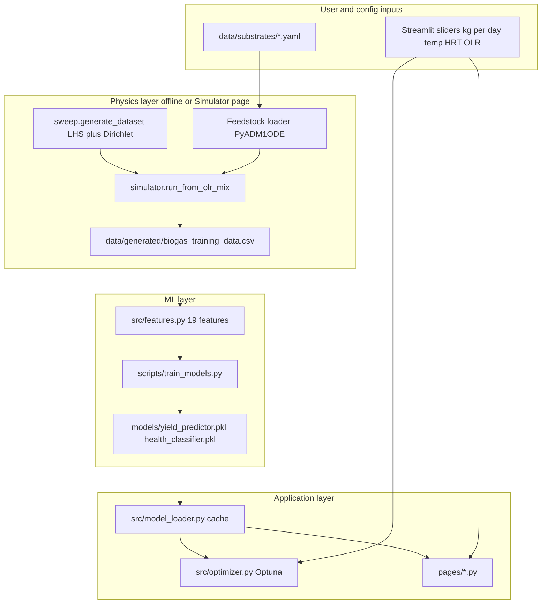

# BioOptima — Comprehensive Project Documentation

**Purpose of this document:** Full technical and scientific context for the BioOptima biogas digital twin. Intended for developers, reviewers, or a new Cursor/AI session that must understand **what was built, why, and how** without re-exploring the entire repository.

**Repository root:** `D:\major project` (or equivalent clone path)

**Last documented training run:** 1000-sample PyADM1ODE sweep (`data/generated/biogas_training_data.csv`), models trained with Optuna tuning (`models/eval_metrics.json`, `tuned: true`).

---

## Table of contents

1. [Project overview](#1-project-overview)
2. [System architecture](#2-system-architecture)
3. [Chemical engineering fundamentals](#3-chemical-engineering-fundamentals)
4. [Indian feedstock library](#4-indian-feedstock-library)
5. [Data generation strategy](#5-data-generation-strategy)
6. [Feature engineering](#6-feature-engineering)
7. [ML models and training](#7-ml-models-and-training)
8. [Feedstock optimization](#8-feedstock-optimization)
9. [Health monitoring and early warning](#9-health-monitoring-and-early-warning)
10. [Energy and environmental conversions](#10-energy-and-environmental-conversions)
11. [Literature validation](#11-literature-validation)
12. [Streamlit application (11 pages)](#12-streamlit-application-11-pages)
13. [Notebooks](#13-notebooks)
14. [Dependencies and deployment](#14-dependencies-and-deployment)
15. [Known limitations and future work](#15-known-limitations-and-future-work)
16. [File reference index](#16-file-reference-index)

---

## 1. Project overview

### 1.1 What BioOptima is

**BioOptima** is an interactive **biogas digital twin** for **Indian farm-scale anaerobic digestion (AD)**. It helps users who manage small digesters (roughly village / dairy / cooperative scale) to:

- **Recommend feedstock mixes** from locally available wastes (cow dung, straws, food waste, press mud, poultry litter).
- **Estimate methane production** (m³ CH₄ per day) under chosen temperature, hydraulic retention time (HRT), and organic loading rate (OLR).
- **Assess digester health** (stable / warning / critical) from process indicators or simplified “symptom” inputs.
- **Explore scenarios**, run **physics-based ADM1 simulations**, and view **economics / environmental** side metrics (LPG cylinders, INR savings, CO₂ avoided).

### 1.2 Problem being addressed

Farm-scale biogas plants in India often operate with:

- **Mixed, variable feedstocks** (seasonal straw, variable dung quality, occasional food waste).
- **Limited lab monitoring** (pH/VFA measured rarely).
- **No fast tool** to answer: “If I change the mix or loading, what happens to gas and stability?”

Full **ADM1** (Anaerobic Digestion Model No. 1) simulations are accurate but **slow** (tens of seconds per case). BioOptima uses ADM1 **offline** to build a dataset, then trains **fast surrogate models** (XGBoost) for real-time use in a **Streamlit** web app.

### 1.3 Digital twin concept (three layers)

| Layer | Role | Technology |
|-------|------|------------|
| **Physics** | Ground-truth process behavior | PyADM1ODE (`pyADM1ODE/`), ADM1 ODEs, Indian substrate YAMLs |
| **Surrogates** | Instant predictions for UI | XGBoost regressor (CH₄) + classifier (stability) |
| **Interaction** | Farmer-facing tools | Streamlit multipage app (`app.py`, `pages/`) |

**Design choice:** We do **not** run ADM1 on every button click in production. We run it during **data generation** (1000 LHS points on Colab ~13–15 min with 2 workers) and at user request on the **Live Simulator** page only.

### 1.4 What we explicitly did *not* build

- **No “confidence intervals” or uncertainty bands** in the UI (per project requirement).
- **No third ML model** for “early warning” — replaced by **rule-based** logic on slopes and thresholds (`src/health_utils.py`).
- **No training on random mismatched Kaggle datasets** — external check uses **curated literature points** only (`data/validation/literature_points.csv`).

---

## 2. System architecture

### 2.1 End-to-end data flow



### 2.2 Repository layout (essential files)

```
major project/
├── app.py                          # Streamlit home entry
├── pages/                          # Multipage UI (11 tools)
│   ├── 1_Feed_Optimizer.py
│   ├── 2_Health_Monitor.py
│   ├── 3_Scenario_Explorer.py
│   ├── 4_Sensitivity_Analysis.py
│   ├── 5_Simulator.py
│   ├── 6_Encyclopedia.py
│   ├── 7_Economics.py
│   ├── 8_Environment.py
│   ├── 9_Plant_Sizing.py
│   ├── 10_About.py
│   └── 11_Model_Insights.py
├── src/
│   ├── feedstock_db.py             # Indian substrates, Q builders, COD/C:N
│   ├── simulator.py                # PyADM1ODE wrapper
│   ├── sweep.py                    # LHS dataset generation
│   ├── features.py                 # 19 ML features
│   ├── health_utils.py             # Stability labels + rules
│   ├── optimizer.py                # Optuna feed mix optimization
│   ├── energy_utils.py             # LPG, INR, CO2, trees
│   ├── model_loader.py             # @st.cache_resource models
│   └── ui_helpers.py               # Shared Streamlit UI
├── scripts/
│   ├── train_models.py
│   ├── seed_synthetic_training.py  # Fast fallback data
│   └── validate_against_literature.py
├── data/
│   ├── substrates/                 # 6 bio_*.yaml for PyADM1ODE
│   ├── generated/biogas_training_data.csv
│   └── validation/literature_points.csv
├── models/
│   ├── yield_predictor.pkl
│   ├── health_classifier.pkl
│   ├── eval_metrics.json
│   ├── literature_validation.json
│   └── X_background.pkl            # SHAP background sample
├── pyADM1ODE/                      # Bundled ADM1 implementation
├── notebooks/                      # Colab sweep, EDA, training
├── requirements.txt
└── .streamlit/config.toml
```

### 2.3 Runtime dependency rule (important for Streamlit)

- **`app.py` only** calls `st.set_page_config()`.
- All pages import **`load_models()` from `src.model_loader`**, not from `app.py`, to avoid duplicate page config and UI bleed.
- Models are loaded once per session via `@st.cache_resource`.

---

## 3. Chemical engineering fundamentals

### 3.1 Anaerobic digestion — four stages

1. **Hydrolysis** — Complex organics (polymers, fibers) break to soluble substrates.
2. **Acidogenesis** — Sugars/amino acids → volatile fatty acids (VFAs), CO₂, H₂.
3. **Acetogenesis** — VFAs/H₂ → acetate (and balance with H₂ consumers).
4. **Methanogenesis** — Acetate and H₂/CO₂ → **CH₄**.

**Process stability** depends on keeping **methanogens** (slow, pH-sensitive) in balance with **acidogens** (fast). Overloading causes **VFA accumulation**, **pH drop**, and **methane collapse** — classic “sour digester” failure.

### 3.2 ADM1 (Anaerobic Digestion Model No. 1)

**ADM1** (Batstone et al., IWA) is a structured **dynamic model** for AD:

- **~41 state variables** per digester (soluble/particulate COD fractions, VFA, alkalinity, dissolved H₂, CH₄, biomass groups, etc.).
- **pH** computed from charge balance (acetate, carbonate, ammonia, etc.).
- **Temperature** enters through Arrhenius-style kinetic corrections in the implementation.

**BioOptima uses:** `pyADM1ODE` → `BiogasPlant` + single digester `main_digester` (`src/simulator.py`).

**Typical simulation settings in this project:**

| Parameter | Value | Meaning |
|-----------|-------|---------|
| `V_liq` | 100 m³ | Liquid reactor volume |
| `V_gas` | 20 m³ | Headspace gas volume |
| `sim_days` | 30 | Simulation horizon |
| `dt` / `save_interval` | 1.0 d | Daily output |
| `k_L_a` | 200 | Gas-liquid mass transfer |
| `T_ad` | 273.15 + temp_C | Absolute temperature [K] |

**Outputs extracted per run** (`simulator.run_simulation`):

- `q_ch4_avg` — mean CH₄ flow over last 7 days of saved series [m³/d]
- `pH_final`, `VFA_final`, `S_nh3_final`, `S_ac_final`
- `vfa_slope_last5d`, `ph_slope_last5d` — linear slopes over last ≤5 points
- `first_instability_day` — first day with pH &lt; 6.5 or VFA &gt; 4.0 (simulation-time diagnostic)
- `converged` — ODE integration completed without exception

### 3.3 Key process parameters (definitions used in BioOptima)

| Symbol / term | Definition | Typical units | Role in project |
|---------------|------------|---------------|-----------------|
| **OLR** | Organic loading rate on VS basis | kg VS / (m³ reactor · d) | Sweep LHS dimension; feature `OLR_used` |
| **HRT** | Hydraulic retention time | days | Sweep LHS; scales flows via `build_Q_from_olr_hrt_fractions` |
| **VS** | Volatile solids | kg VS / kg feed | From TS% × VS/TS in `FEEDSTOCK_META` |
| **C/N** | Carbon-to-nitrogen ratio (proxy) | — | Mass-weighted blend in `blended_cn_ratio()` |
| **VFA** | Volatile fatty acids (as HAc-eq in model output) | kg HAc-eq / m³ | Health classification |
| **Free NH₃** | Un-ionized ammonia | kg/m³ | Health score / plots |
| **BMP** | Biochemical methane potential | Nm³ CH₄ / t VS (literature meta) | Substrate quality indicator in UI |

### 3.4 COD fractionation (for ML features only)

From `src/feedstock_db.py` (documented in module docstring):

| Fraction | COD factor (kg COD / kg component) |
|----------|-------------------------------------|
| Carbohydrates (`COD_CH`) | 1.07 |
| Proteins (`COD_PR`) | 1.42 |
| Lipids (`COD_LI`) | 2.88 |
| Inerts (`COD_XI`) | 1.42 |

**COD proxy** for a mix (in `features._mix_biochem`):

\[
\text{COD\_proxy} = \sum_i w_i \left( f_{ch,i}\cdot 1.07 + f_{pr,i}\cdot 1.42 + f_{li,i}\cdot 2.88 + f_{xi,i}\cdot 1.42 \right)
\]

where \(w_i\) are normalized mass fractions over six substrates and \((f_{ch}, f_{pr}, f_{li}, f_{xi})\) come from `BIOCHEM_VS`.

### 3.5 Mapping daily mass to reactor flows (OLR + HRT)

**Target VS loading:**

\[
\dot{m}_{VS,total} = \text{OLR} \times V_{liq} \quad [\text{kg VS/d}]
\]

Per substrate \(i\), with VS fraction \(f_i\) (Dirichlet sample, sum = 1):

\[
\dot{m}_{VS,i} = \dot{m}_{VS,total} \cdot f_i
\]

Volumetric flow to digester slot \(i\) (PyADM1ODE `Q` vector, m³/d):

\[
Q_i = \frac{\dot{m}_{VS,i}}{\text{vs\_content}(i)} 
\]

where `vs_content(i)` is kg VS per m³ of feed from the `Feedstock` object.

**HRT consistency** (`build_Q_from_olr_hrt_fractions`):

1. Build \(Q\) from OLR.
2. Compute \( \text{HRT}_0 = V_{liq} / \sum Q_i \).
3. Scale all \(Q_i\) by \( \text{HRT}_0 / \text{HRT}_{target} \).
4. Achieved OLR scales proportionally → stored as `OLR_used`.

This ensures the sampled **HRT** in the training CSV is physically tied to the flow field, not independent fiction.

### 3.6 Stability classification (labels for ML)

Implemented in `health_utils.classify_stability(pH, vfa_kg_m3)`:

| Class index | Name | Rule |
|-------------|------|------|
| 0 | **Stable** | Otherwise |
| 1 | **Warning** | pH &lt; 6.8 **or** pH &gt; 7.8 **or** VFA &gt; 1.5 kg/m³ |
| 2 | **Critical** | pH &lt; 6.5 **or** VFA &gt; 3.0 kg/m³ |

**Note:** VFA units from PyADM1ODE are **kg HAc-eq/m³** (Schlattmann 2011 style), aligned with ~1500 mg/L order of magnitude at 1.5.

Labels are applied **after** each converged simulation using **final** pH/VFA, not the ML classifier — the classifier learns to predict these labels from **input features** (mix, T, HRT, OLR, engineered terms).

---

## 4. Indian feedstock library

Six substrates, fixed order in code (`SUBSTRATE_IDS`):

`bio_cow_dung`, `bio_rice_straw`, `bio_wheat_straw`, `bio_food_waste`, `bio_press_mud`, `bio_poultry_litter`

### 4.1 Summary table (UI / feature metadata)

| Substrate ID | Display name | C/N | BMP (Nm³/t VS) | TS (% FM) | VS/TS | Bulk density (kg/m³) |
|--------------|--------------|-----|----------------|-----------|-------|----------------------|
| bio_cow_dung | Cow dung | 18 | 200 | 20 | 0.775 | 1000 |
| bio_rice_straw | Rice straw | 50 | 230 | 90 | 0.825 | 150 |
| bio_wheat_straw | Wheat straw | 90 | 240 | 89 | 0.84 | 150 |
| bio_food_waste | Food waste | 17 | 380 | 25 | 0.90 | 900 |
| bio_press_mud | Press mud | 20 | 260 | 72 | 0.75 | 700 |
| bio_poultry_litter | Poultry litter | 7.5 | 280 | 62 | 0.685 | 600 |

### 4.2 Biochemical VS fractions (for COD proxy and protein features)

Format: `(f_ch, f_pr, f_li, f_xi)` — fractions of volatile solids:

| Substrate | f_ch | f_pr | f_li | f_xi |
|-----------|------|------|------|------|
| Cow dung | 0.35 | 0.20 | 0.10 | 0.35 |
| Rice straw | 0.65 | 0.05 | 0.02 | 0.28 |
| Wheat straw | 0.60 | 0.05 | 0.02 | 0.33 |
| Food waste | 0.50 | 0.25 | 0.15 | 0.10 |
| Press mud | 0.40 | 0.12 | 0.08 | 0.40 |
| Poultry litter | 0.25 | 0.35 | 0.10 | 0.30 |

**Engineering interpretation:**

- **Straws** — high carbohydrate / fiber (high C/N), slow hydrolysis, need nitrogen co-feed.
- **Food waste** — high BMP, high protein/lipid, rapid acidogenesis → VFA risk if overloaded.
- **Poultry litter** — high protein/N → ammonia inhibition risk; low C/N.

### 4.3 PyADM1ODE YAML parameters (per substrate file)

Each `data/substrates/bio_*.yaml` supplies fields consumed by `pyadm1.Feedstock`, including:

| Field | Meaning (simplified) |
|-------|-------------------------|
| **TS** | Total solids content parameter in model units |
| **NH4** | Ammonium-related input |
| **BGP** | Biogas potential-related |
| **BMP** | Methane potential anchor |
| **aXI** | Inert particulate fraction parameter |
| **fOTSrf, fsOTS, ffOTS** | Organic fraction split (slow/fast etc.) |
| **aSi** | Inert inorganic fraction |
| **fRF, fRP, fRFe, fRA** | Residual fraction splits (lipid/protein/fermentation products) |
| **Temp, pH** | Reference feed properties |
| **KS43, FFS** | Degradation / feed frequency related |

**Example — cow dung (`bio_cow_dung.yaml`):** TS 200, BMP 200, BGP 220, NH4 1.5, aXI 0.45, pH 7.0.

**Example — food waste (`bio_food_waste.yaml`):** TS 250, BMP 380, BGP 650, lower aXI 0.22 (more degradable), pH 5.5.

**Example — poultry litter (`bio_poultry_litter.yaml`):** TS 620, NH4 6.0, high protein splits (fRP 0.28), BMP 280.

These YAMLs were **tuned for Indian feedstocks** (not default European maize/silage files in `pyADM1ODE/data/substrates/`).

### 4.4 Practical co-digestion tips (shown in Encyclopedia)

Stored in `PRACTICAL_TIPS` in `feedstock_db.py` — e.g. straw needs dung/food waste for C/N; poultry litter needs dilution; food waste limited share if VFA spikes.

---

## 5. Data generation strategy

### 5.1 Primary path: PyADM1ODE sweep (production training data)

**Script / module:** `src/sweep.py`  
**Colab notebook:** `notebooks/00_generate_sweep_colab.ipynb` (live tqdm + matplotlib dashboard)

**Completed run (user):** N = **1000**, workers = **2**, wall time ≈ **13.5 min** on Colab, **100% converged**.

#### 5.1.1 Sampling design

**Feedstock mix — Dirichlet distribution**

\[
\mathbf{f} \sim \text{Dirichlet}(\alpha), \quad \alpha = [2.0,\, 1.0,\, 1.0,\, 1.0,\, 0.5,\, 0.8]
\]

Indices map to: cow, rice, wheat, food, press, poultry.  
**Why:** Cow dung is the most common Indian base feed; higher α₀ skews samples toward dung-rich mixes while still exploring co-digestion.

**Operating conditions — Latin Hypercube Sampling (LHS)** on 3 dimensions (`pyDOE2.lhs`):

| Variable | Range | Units |
|----------|-------|-------|
| Temperature | 28 – 40 | °C (mesophilic band) |
| HRT | 15 – 40 | days |
| OLR | 1.0 – 5.0 | kg VS/m³/d |

**Why LHS:** Space-filling design gives better coverage than random uniform for a fixed budget of 1000 runs.

**Fixed reactor geometry in sweep:**

- `V_liq = 100` m³  
- `sim_days = 30`  
- `seed = 42` (reproducibility)

#### 5.1.2 Output CSV schema (`biogas_training_data.csv`)

Key columns per row:

| Column | Description |
|--------|-------------|
| `idx` | Sample index |
| `cow_frac` … `poultry_frac` | Dirichlet masses (sum 1) |
| `temperature_C`, `HRT_days`, `OLR` | Sampled operating point |
| `OLR_used` | After HRT scaling |
| `converged` | Simulation success |
| `q_ch4_avg` | Target for regressor [m³/d] |
| `pH_final`, `VFA_final`, `S_nh3_final` | Final state |
| `vfa_slope_last5d`, `ph_slope_last5d` | Dynamics |
| `stability_label` | 0/1/2 from rules, or -1 if failed |
| `sim_error` | Exception string if any |

#### 5.1.3 Post-sweep statistics (1000-row ADM1 dataset)

From Colab sanity cell:

- **Rows:** 1000, **converged:** 1000 (100%)
- **`q_ch4_avg`:** mean ≈ 131.9, min ≈ 0.004, max ≈ 437.2 m³/d
- **`pH_final`:** mean ≈ 6.62, min ≈ 3.96, max ≈ 7.44
- **`VFA_final`:** mean ≈ 17.1, max ≈ 111.5 (wide tail — stressed cases)
- **`stability_label`:** heavily skewed toward class **2 (Critical)** in distribution (median 2.0) — important for classifier training

Histogram shows a **spike near zero CH₄** — valid ADM1 outcomes for unfavorable mixes (not “failed” runs).

### 5.2 Fallback path: semi-empirical synthetic data

**Script:** `scripts/seed_synthetic_training.py`  
**When used:** CI, quick UI testing, no PyADM1ODE install  
**Size:** 2000 rows, &lt; 2 seconds

**Formulas (literature-inspired structure, not ADM1):**

**Methane yield:**

\[
q_{CH4} = \frac{BMP_{mix}}{1000} \cdot OLR \cdot V_{liq} \cdot \underbrace{(1 - e^{-HRT/8})}_{\text{HRT saturation}} \cdot \underbrace{e^{0.069(T-35)}}_{\text{Arrhenius-ish}} \cdot \underbrace{\frac{1}{1 + e^{3(OLR-4.5)}}}_{\text{OLR inhibition}} \cdot (1 + \mathcal{N}(0, 0.08))
\]

**pH:**

\[
pH = 7.2 - 0.3\frac{\max(0,15-CN)}{15} - 0.4\max(0,OLR-3.5) - 0.15\max(0,prot-0.25) + \mathcal{N}(0,0.08)
\]

**VFA:** base + OLR excess + food fraction term + lipid term + noise.

**NH₃:** base + protein + temperature.

Then `classify_stability(pH, VFA)` assigns labels.

**Why keep this:** Reproducible pipeline without hours of ODE integration; **not** used for final reported models once ADM1 CSV exists.

---

## 6. Feature engineering

**Module:** `src/features.py`  
**Count:** **19 features** (`FEATURE_COLUMNS`)

### 6.1 Raw inputs (9)

| Feature | Source |
|---------|--------|
| `cow_frac` … `poultry_frac` | Mass fractions (6) |
| `temperature_C` | °C |
| `HRT_days` | days |
| `OLR` | Achieved kg VS/m³/d (HRT-first sweep; ML feature) |
| `OLR_used` | Same as `OLR` in new CSV (legacy column name) |

### 6.2 Derived features (6)

| Feature | Formula / logic |
|---------|-----------------|
| `CN_ratio` | Mass-weighted `FEEDSTOCK_META[sid].cn` |
| `VS_total` | `OLR * HRT_days` (proxy for total VS turnover) |
| `temp_HRT` | `temperature_C * HRT_days` |
| `lipid_frac_mix` | Weighted `BIOCHEM_VS` lipid fractions |
| `protein_frac_mix` | Weighted protein fractions |
| `COD_proxy` | Weighted COD from CH/PR/LI/XI factors |

### 6.3 Interaction features (4) — why added

| Feature | Formula | Rationale |
|---------|---------|-----------|
| `OLR_x_food_frac` | `OLR * food_frac` | Food waste acidogenesis + high loading → VFA shocks |
| `protein_to_CN` | `protein_frac_mix / CN_ratio` | Ammonia inhibition proxy when protein high and C/N low |
| `OLR_per_HRT` | `OLR / HRT_days` | Intensity per unit retention |
| `lipid_x_temp` | `lipid_frac_mix * temperature_C` | Lipid hydrolysis/methanogenesis temperature coupling |

**Alignment rule:** Training CSV columns use `cow_frac` etc.; UI may pass `cow_dung_frac` — `row_dict_to_features` accepts aliases.

**Single-row prediction:** `feature_matrix(row)` → shape `(1, 19)` float32 for XGBoost.

---

## 7. ML models and training

**Script:** `scripts/train_models.py`

### 7.1 Why XGBoost?

| Criterion | Choice |
|-----------|--------|
| Speed at inference | Milliseconds in Streamlit |
| Tabular heterogeneous features | Strong default for structured AD features |
| Nonlinear interactions | Captures OLR×food, etc. without manual polynomials |
| Deployment | `joblib` + optional JSON booster export |

**Not used:** Deep learning (data too small), Gaussian processes (slow), linear models (too rigid for inhibition-like behavior).

### 7.2 Targets

| Model | Type | Target | Unit / classes |
|-------|------|--------|----------------|
| **Yield regressor** | `XGBRegressor` | `q_ch4_avg` | m³ CH₄/d at V_liq=100 m³ |
| **Health classifier** | `XGBClassifier` | `stability_label` | 0 Stable, 1 Warning, 2 Critical |

**Filter before train:** `converged == True` and `stability_label >= 0`.

### 7.3 Train/test split

- **15% test**, `random_state=42`
- **Stratify** on `stability_label` when possible (fallback to unstratified if rare classes break split)

### 7.4 Training procedure

1. Build `X = dataframe_features(df)`.
2. Save `models/X_background.pkl` — 100 random train rows for SHAP.
3. Fit regressor with `eval_set=(X_test, y_test)` for early stopping monitoring (verbose off).
4. Fit classifier similarly (`multi:softprob`, 3 classes).
5. Write `yield_predictor.pkl`, `health_classifier.pkl`, `.json` boosters, `eval_metrics.json`.

### 7.5 Optuna hyperparameter tuning (`--tune`)

**Regressor objective:** maximize 5-fold CV **R²** on yield (stratified bins of y for fold splits).

**Search space (regressor):**

- `n_estimators` 200–800 step 50  
- `max_depth` 3–8  
- `learning_rate` log-uniform 0.01–0.15  
- `subsample`, `colsample_bytree` 0.5–1.0  
- `min_child_weight` 1–10  

**Classifier objective:** maximize 5-fold **F1-macro**.

**Classifier search space:** similar with `n_estimators` 150–600, `max_depth` 3–7.

### 7.6 Results (current `models/eval_metrics.json`, tuned)

**Dataset:** n_total = **1000**, train = **850**, test = **150**

| Metric | Value |
|--------|-------|
| **Yield R²** | **0.705** |
| **Yield RMSE** | **45.15** m³/d |
| **Health accuracy** | **0.96** |
| **Health F1-macro** | **0.804** |

**Per-class test support (imbalanced):**

| Class | Precision | Recall | F1 | Support |
|-------|-----------|--------|-----|---------|
| Stable (0) | 1.00 | 0.75 | 0.86 | 4 |
| Warning (1) | 0.67 | 0.50 | 0.57 | 8 |
| Critical (2) | 0.97 | 0.99 | 0.98 | 138 |

**Best tuned regressor params (stored):**

- n_estimators=300, max_depth=7, learning_rate≈0.0217, subsample≈0.718, colsample_bytree≈0.860, min_child_weight=4

**Best tuned classifier params (stored):**

- n_estimators=250, max_depth=6, learning_rate≈0.0400, subsample≈0.797, colsample_bytree≈0.935, min_child_weight=2

**Interpretation:** Surrogate explains ~70% of variance in ADM1 CH₄ on held-out sweep cases — reasonable for a single global model. Health metrics look strong but **macro F1 is dominated by class 2**; rare Stable/Warning cases are harder (few test samples).

### 7.7 SHAP explainability

- **Background:** `X_background.pkl`
- **UI:** `pages/11_Model_Insights.py` — beeswarm + waterfall (`shap`, `streamlit-shap`)
- **Notebook:** `notebooks/03_model_training.ipynb`

---

## 8. Feedstock optimization

**Module:** `src/optimizer.py`  
**UI:** `pages/1_Feed_Optimizer.py`

### 8.1 Problem statement

Given **available daily masses** (kg/d) for each feedstock and operating settings (`temp_C`, `HRT_days`, `OLR`, `V_liq`), find **mass fractions** that **maximize predicted CH₄** while penalizing unstable health classes.

### 8.2 Optuna formulation

- **Trial variables:** `m0..m5` ∈ [0, avail_i] (continuous, up to available kg).
- **Feasible mix:** `use = min(raw, avail)`, normalize to mass fractions.
- **Predict:** `feature_matrix` → yield model + health model.

**Objective:**

```text
if health == Critical (2): return 0
if health == Warning (1): return 0.7 * yhat
else: return yhat
```

**Study:** maximize, default **200 trials** (`n_trials=200`).

### 8.3 Baseline comparison

**Baseline** = user’s input masses normalized to fractions (what they would feed without optimization).  
**Improvement %** = `(y_best - y0) / y0 * 100`.

### 8.4 Example observed behavior

With large cow dung availability but optimizer favoring straw-rich mix: the model learned from ADM1 that **high BMP / OLR / HRT combinations** with straw-heavy fractions can maximize `q_ch4_avg` within health constraints — the optimizer is **not** forced to use all available dung, only to respect **upper bounds** per feedstock.

---

## 9. Health monitoring and early warning

### 9.1 ML classifier + rules (hybrid)

- **Classifier:** predicts Stable / Warning / Critical from **features** (same 19 as yield).
- **Early warning:** `early_warning()` — **no third ML model**.

### 9.2 Early warning rules (`health_utils.early_warning`)

| Condition | Risk contribution |
|-----------|-------------------|
| Current health Critical | risk = 100, strong message |
| Current health Warning | +50 |
| `vfa_slope > 0.15` kg/m³/d | +25 |
| `ph_slope < -0.04` /d | +25 |
| `VFA > 2.0` and `pH < 6.85` | +20 |

**Risk level:** &gt;70 Critical, &gt;30 Warning, else Stable.

### 9.3 Quick mode (symptom → pseudo lab readings)

`infer_readings_from_quick_mode(gas_drop, bad_smell, foam, feed_change, season_temp)` adjusts default pH/VFA/NH₃ for users without lab data — then classifier + rules run.

### 9.4 Health score 0–100

`health_score_from_readings` — piecewise deductions from pH bands, VFA bands, NH₃ &gt; 0.08, capped at [0, 100].

### 9.5 UI risk zones (`ui_helpers.reading_zone_figure`)

Plotly strip charts with green/yellow/red bands for pH, VFA, NH₃ and a marker for current reading.

---

## 10. Energy and environmental conversions

**Module:** `src/energy_utils.py`  
**Purpose:** Farmer-facing **LPG cylinder** and **rupee** equivalents (order-of-magnitude, not contractual energy accounting).

| Constant | Value | Meaning |
|----------|-------|---------|
| `CH4_M3_TO_LPG_KG` | 0.75 | kg LPG equivalent per m³ CH₄ |
| `LPG_CYLINDER_KG` | 14.2 | kg per domestic cylinder |
| `INR_PER_CYLINDER` | 900 | Default ₹/cylinder |
| `CO2_AVOIDED_PER_M3_CH4` | 2.0 | kg CO₂-eq per m³ CH₄ (illustrative substitution) |
| `TREE_CO2_PER_YEAR` | 22 | kg CO₂ uptake per tree per year (illustrative) |

**Formulas:**

- LPG cylinders/day = `(ch4_m3 * 0.75) / 14.2`
- INR/day = cylinders × INR_per_cylinder  
- CO₂ avoided kg/day = `ch4_m3 * 2.0`  
- Trees equivalent = CO₂ / (22 × years)

Used on Feed Optimizer, 7-Day Forecast, Economics, Environment pages.

---

## 11. Literature validation

**Data:** `data/validation/literature_points.csv` (21 points)  
**Script:** `scripts/validate_against_literature.py`  
**Results:** `models/literature_validation.json`

### 11.1 Methodology

- Literature reports **specific yield** (m³ CH₄ per m³ reactor per day) in `observed_specific_yield`.
- Model predicts **absolute** `q_ch4_avg` for V_liq=100 m³, then **divides by 100** for comparison.

**Why specific yield:** Lab/pilot reactors in papers are not all 100 m³; this unit aligns orders of magnitude.

### 11.2 Aggregate results (tuned model)

| Metric | Value |
|--------|-------|
| **MAPE** | **73.8%** |
| **R²** | **-4.90** |
| **n_points** | 21 |

### 11.3 Why literature R² is poor (expected, not a deployment bug)

1. **Surrogate trained on ADM1** with **Indian YAML kinetics**, not on each paper’s reactor.
2. **Observed values** are curated estimates from tables/figures — uncertainty ±20–30% typical.
3. **Temperature** in papers includes **53°C thermophilic** point outside training range (28–40°C).
4. **Press mud** and **mono-dung** cases show largest overprediction — ADM1 YAML may be optimistic vs those studies.

**Better-performing literature cases (error ~20–30%):** food waste + dung blends at 37°C, several co-digestion points.

**Use in report:** Present as **external plausibility check**, not primary accuracy claim. Primary accuracy = **hold-out R² on ADM1 sweep** (~0.70).

### 11.4 All 21 literature points (summary)

| Source | Substrate | obs (m³/m³/d) | pred (tuned) | err % |
|--------|-----------|---------------|--------------|-------|
| MDPI Bioeng. 2022 | Cow dung mesophilic | 0.40 | 0.77 | 91 |
| MDPI Bioeng. 2022 | Cow dung thermophilic | 0.36 | 0.83 | 130 |
| Frontiers Energy Res. 2025 | FW + dung 70:30 | 0.95 | 1.16 | 22 |
| Frontiers Energy Res. 2025 | FW + dung 50:50 | 0.76 | 0.98 | 29 |
| Frontiers Energy Res. 2025 | FW + dung 30:70 | 0.59 | 0.84 | 43 |
| IJERT 2020 | Kitchen + dung 1:1 | 0.58 | 0.96 | 65 |
| IJERT 2020 | Cattle dung only | 0.30 | 0.76 | 153 |
| Springer AAER 2023 | Dung + market waste | 0.82 | 0.98 | 20 |
| Indian J. Anim. Sci. 2019 | Rice + dung 40:60 | 0.46 | 0.99 | 115 |
| Indian J. Anim. Sci. 2019 | Rice + dung 20:80 | 0.43 | 0.82 | 91 |
| Waste Mgmt 2021 | Wheat + dung 30:70 | 0.52 | 0.80 | 54 |
| Waste Mgmt 2021 | Wheat + dung 50:50 | 0.48 | 1.12 | 133 |
| Sugar Tech 2020 | Press mud mono | 0.52 | 1.64 | 216 |
| Sugar Tech 2020 | Press mud + dung | 0.60 | 1.01 | 69 |
| Poultry Sci. 2018 | Poultry mono | 0.56 | 0.45 | 20 |
| Poultry Sci. 2018 | Poultry + dung | 0.48 | 1.16 | 141 |
| Bioresource Tech. 2019 | FW + rice + dung | 0.68 | 0.82 | 20 |
| Bioresource Tech. 2019 | FW + rice + dung | 0.74 | 0.97 | 31 |
| Environ. Sci. Pollut. Res. 2022 | Dung + press + straw | 0.57 | 0.86 | 51 |
| Renew. Energy 2021 | Food waste only high OLR | 1.00 | 1.33 | 33 |
| Renew. Energy 2021 | FW + dung 40:60 | 0.72 | 0.89 | 24 |

---

## 12. Streamlit application (11 pages)

| Page | File | Function |
|------|------|----------|
| **Home** | `app.py` | Status, navigation cards for all tools |
| **Feed Optimizer** | `1_Feed_Optimizer.py` | kg/d inputs, temp, HRT/OLR, Optuna mix, CH₄/LPG/₹/CO₂ metrics, pie chart |
| **Health Monitor** | `2_Health_Monitor.py` | Lab readings or quick symptoms, classifier, zones, early warning |
| **Scenario Explorer** | `3_Scenario_Explorer.py` | Side-by-side current vs proposed mix |
| **Sensitivity analysis** | `4_Sensitivity_Analysis.py` | Temperature what-if bars (not a dynamic forecast) |
| **Live Simulator** | `5_Simulator.py` | Full PyADM1ODE time series (pH, VFA, CH₄, NH₃) |
| **Encyclopedia** | `6_Encyclopedia.py` | Feedstock properties, BMP, tips, bar charts |
| **Economics** | `7_Economics.py` | Payback, cash flow (illustrative) |
| **Environment** | `8_Environment.py` | CO₂, trees, SDG messaging |
| **Plant Sizing** | `9_Plant_Sizing.py` | Volume from waste + HRT, OLR check |
| **About** | `10_About.py` | AD stages, ADM1, architecture, glossary |
| **Model Insights** | `11_Model_Insights.py` | SHAP beeswarm/waterfall, literature scatter |

**Session state:** Feed Optimizer stores `opt_result` for CH₄ prefill on Economics/Environment (`ui_helpers.ch4_from_session_state`).

---

## 13. Notebooks

| Notebook | Role |
|----------|------|
| `00_generate_sweep_colab.ipynb` | Mount Drive, install deps, smoke test, **1000-run sweep** with tqdm + live plots + audio milestones, sanity histogram, download CSV |
| `01_benchmark_and_validate.ipynb` | Single `run_from_olr_mix` timing and qualitative check |
| `02_eda.ipynb` | Load CSV, target histograms, class balance, correlation heatmap, pairplot |
| `03_model_training.ipynb` | Train/test, scatter, confusion matrix, SHAP, 5-fold CV, literature plot |

**Optional for app:** Notebooks are **not required** at runtime if `models/*.pkl` exist.

---

## 14. Dependencies and deployment

### 14.1 `requirements.txt` (summary)

**Runtime (app):** streamlit, numpy, scipy, pandas, plotly, xgboost, scikit-learn, optuna, joblib, shap, streamlit-shap  

**Data / notebooks:** PyYAML, pyDOE2, matplotlib, seaborn, jupyter  

**Not on Streamlit Cloud:** PyADM1ODE (only needed for sweep generation and Simulator page if bundled).

### 14.2 Local run

```powershell
cd "D:\major project"
pip install -r requirements.txt
python scripts/train_models.py          # if models missing
streamlit run app.py
```

**After retraining:** restart Streamlit (Ctrl+C) so `@st.cache_resource` reloads pickles.

### 14.3 Colab sweep

1. Sync project to Google Drive (`major_project` folder with `src/`, `pyADM1ODE/`, `data/substrates/`).
2. Run `notebooks/00_generate_sweep_colab.ipynb`.
3. Copy `data/generated/biogas_training_data.csv` to local repo.
4. `python scripts/train_models.py` (optional `--tune`).

### 14.4 Streamlit Cloud

- Main file: `app.py`
- Commit `models/yield_predictor.pkl`, `health_classifier.pkl`, `eval_metrics.json`, `X_background.pkl`
- Simulator page requires `pyADM1ODE/` in repo if full physics on cloud is desired

---

## 15. Known limitations and future work

| Limitation | Impact | Possible improvement |
|------------|--------|----------------------|
| Surrogate trained on **ADM1**, not field plants | Raw literature MAPE high; bias-corrected ~25% on in-range points | Regenerate data with HRT-first sweep (3000 rows); calibrate YAMLs |
| **Class imbalance** (mostly Critical labels on old CSV) | Weak Stable/Warning recall | HRT-first sweep + SMOTE in `train_models.py` |
| **Mesophilic sampling** 25–45°C (new sweep) | Thermophilic literature still excluded | Report OOR points separately (validation script) |
| **V_liq fixed** 100 m³ | Absolute m³/d not scalable to all plants | Add `V_liq` as feature or predict specific yield only |
| Optimizer uses **mass bounds**, not minimum dung inclusion | May recommend little dung | Add policy constraints (min fraction, min kg) |
| Semi-empirical fallback ≠ ADM1 | Don't mix fallback train with ADM1 deploy | Document which CSV trained current pickles |
| No uncertainty quantification in UI | By design | — |

---

## 16. File reference index

| Path | Responsibility |
|------|----------------|
| `src/feedstock_db.py` | Substrate constants, Q builders, C/N, VS estimates |
| `src/simulator.py` | PyADM1ODE `BiogasPlant` wrapper, time series |
| `src/sweep.py` | HRT-first LHS + Dirichlet (OLR derived, 0.5–8 band) |
| `src/feedstock_db.py` | `build_Q_from_hrt_fractions()` for sweep |
| `src/features.py` | 19-feature engineering |
| `src/health_utils.py` | Labels, early warning, quick mode |
| `src/optimizer.py` | Optuna feed optimization |
| `src/energy_utils.py` | LPG/INR/CO₂/trees |
| `src/model_loader.py` | Cached model load |
| `src/ui_helpers.py` | Sidebar, metrics, zone plots |
| `scripts/train_models.py` | Multi-model CV (XGB/LGBM/RF/stacking) + SMOTE |
| `scripts/seed_synthetic_training.py` | Fast synthetic CSV |
| `scripts/validate_against_literature.py` | External validation JSON |
| `data/generated/biogas_training_data.csv` | Training data (1000 ADM1 rows) |
| `data/validation/literature_points.csv` | 21 literature points |
| `models/*.pkl` | Deployed surrogates |
| `models/eval_metrics.json` | Test metrics + best params |
| `models/literature_validation.json` | Literature MAPE/R² |

---

## Quick context for a new Cursor chat

**Regenerate training data (Colab, HRT-first, 3000 samples):**

Run `notebooks/00_generate_sweep_colab.ipynb` → copy CSV to `data/generated/biogas_training_data.csv`.

**Retrain after new CSV:**

```powershell
pip install -r requirements.txt
python scripts/train_models.py
python scripts/validate_against_literature.py
streamlit run app.py
```

Optional: `python scripts/train_models.py --tune --n-trials 60`

**ML feature `OLR`:** uses achieved organic loading (kg VS/m³/d), aligned with UI sliders — not the old inflated `OLR_used` from OLR+HRT double scaling.

**If Feed Optimizer shows wrong scale:** confirm `models/` match `biogas_training_data.csv` used in last train.

**If literature validation worsens after tuning:** Optuna optimizes ADM1 hold-out R², not literature — expected trade-off.

---

## 17. Overhaul notes (HRT-first pipeline)

### Root cause fixed

Previously, `build_Q_from_olr_hrt_fractions()` scaled flows to match HRT **after** setting OLR, inflating `OLR_used` to ~6–46 while the UI sent OLR 0.5–6. The ML feature `OLR_used` had **zero** training rows in the UI range.

**Fix:** `build_Q_from_hrt_fractions()` sets `Q_total = V_liq / HRT`, splits flow by mix, and stores **`OLR`** = achieved loading. Sweep rejects samples outside [0.5, 8.0] kg VS/m³/d.

### Training script

- Compares **XGBoost, LightGBM, Random Forest, Stacking** via 5-fold CV
- Deploys best regressor/classifier to `models/*.pkl`
- Classifier training uses **SMOTE** when `imbalanced-learn` is available
- Writes `models/model_comparison.json`, `training_ranges` in `eval_metrics.json`

### Literature validation

- Excludes points outside training T/HRT/OLR (e.g. 53°C thermophilic)
- Reports **bias correction** MAPE (linear fit on in-range points)
- Per-category breakdown (mono vs co-digestion)

### UI

- Home page shows CV metrics and training ranges
- `warn_if_out_of_training_range()` on Feed Optimizer
- **Sensitivity analysis** replaces misleading “7-day forecast” line chart

---

*End of BioOptima project documentation.*
